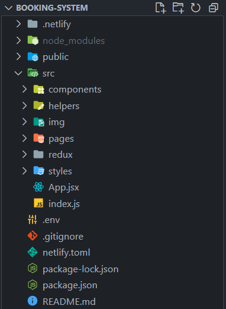
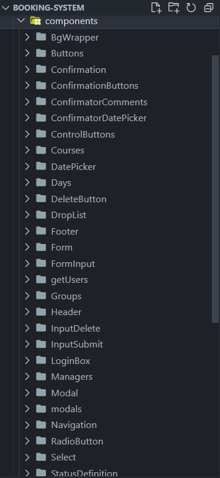
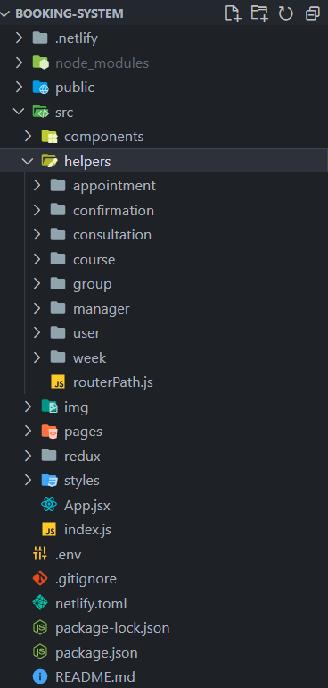
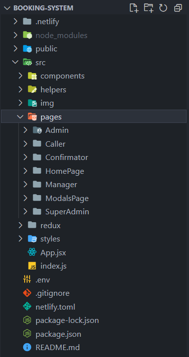
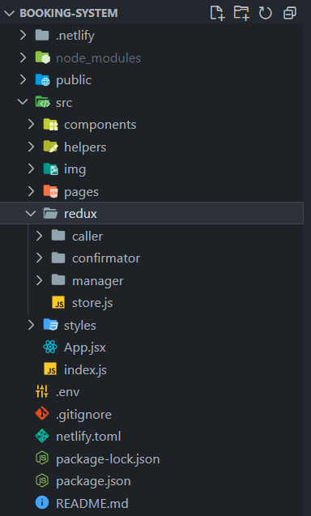
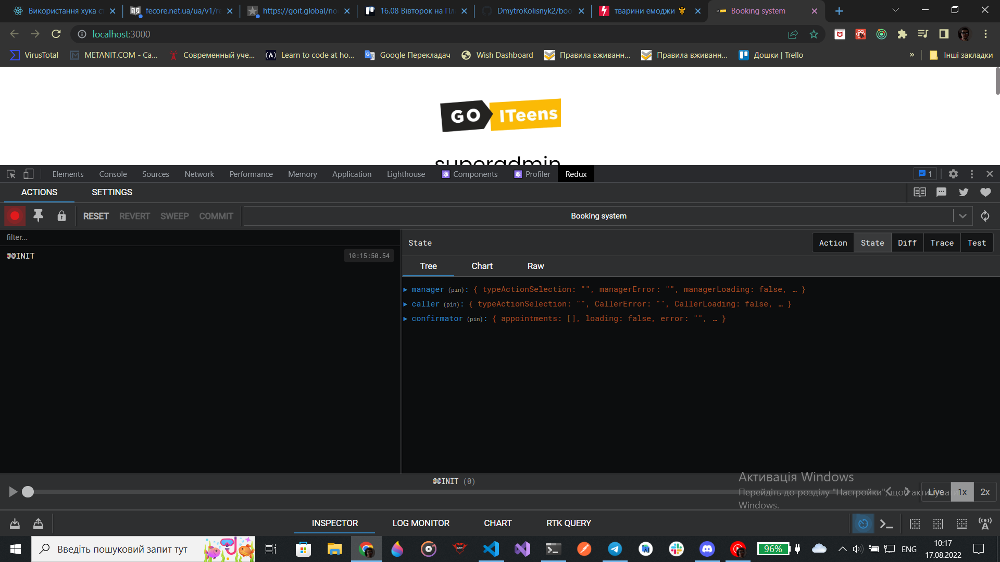
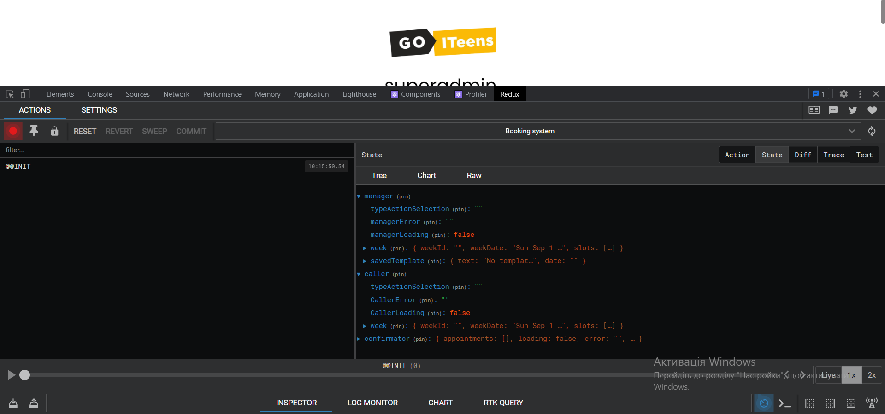
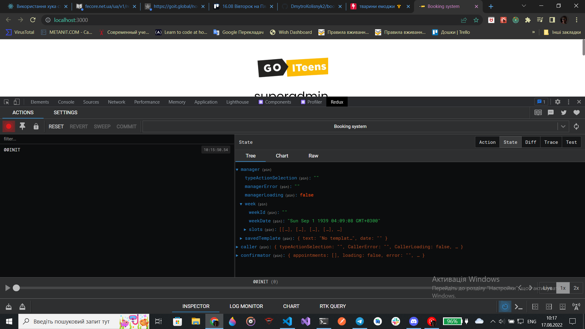

# Booking system
- [Descrption](#description)
- [Our Team](#our-team)
- [Tech Process](#tech-process)
  - [Project structure](#project-structure)
  - [Redux structure](#redux-structure)

## Description

Intern проект нашої команди з використанням `react 18.0.2, redux, scss, momentJS, react router 6` та інших бібліотек.   
На даний момент готові сторінки -
- `Caller` - людини що назначає зустрічі на конкретного менеджера в конкретний час,   
- `Manager` - що обирає коли в нього вільний час, коли робочий, а коли консультації, а також може запускати та змінювати інформацію констультацій
- `Confirmator` - що змінує статус зустрічі, яку назначає коллер, перенесена, відмінена, або ж підтверджена, а також коментар до зустрічі
- `Superadmin`- що створює адмінів та інших користувачів, курси і групи
- `admin` - що створює користувачів, курси і групи

В майбутньому плануємо додати `авторизацію`, `зміну мови` :)

## Our team

Наша команда складається з 8'ми людей, всі вони внесли свій вклад у проект, тим самим пришвидшивши його реліз, а ось і наша команда:

#### `Design`
- [Ярина Виноградова](https://www.figma.com/files/recent?fuid=966368081114943131) - Дизайнер, розробила дизайн проєкту;

#### `Front_End`
  Наші фронтендери 🥰🥰🥰
- [Дмитро Колісник](https://github.com/DmytroKolisnyk2) - TeamLead, керував розробкою проєкту, розробив сторінку `Confirmator`, а також слідкував за кодом;
- [Максим Попсуй](https://github.com/MaxPopsuy)  - Розробив мультифункіональні компоненти, модальні вікна і сторінку `Caller`, а також займався внесенням правок і багфіксом; 
- [Ігор Якіб'юк](https://github.com/Igoryakib)   - Розробив структуру Redux (Duuuucks 🦆) для проєкту, мультифункціональні компоненти, сторінку `Manager`, а також займався внесенням правок і багфіксом;
- [Анна-Домініка Козак](https://github.com/Anna-Dominika1) - Розробила сторінку `SuperAdministator` і `Administrator`;  
- [Євген Бочаров](https://github.com/Eugene-Bocharov)   - Брав участь у розробці сторінки `Manager`;

#### `Back_End`
Наші пайтоністи 🥰🥰🥰
- [Ярослав Висоцький](https://github.com/Yaroslav702) - Розробив структуру `Back_End`  
- [Олександр Зборовський](https://github.com/dormyyy)  - Створював роути `Back_End`

## Tech process

- ### `Project structure`

- ### `Redux structure`

