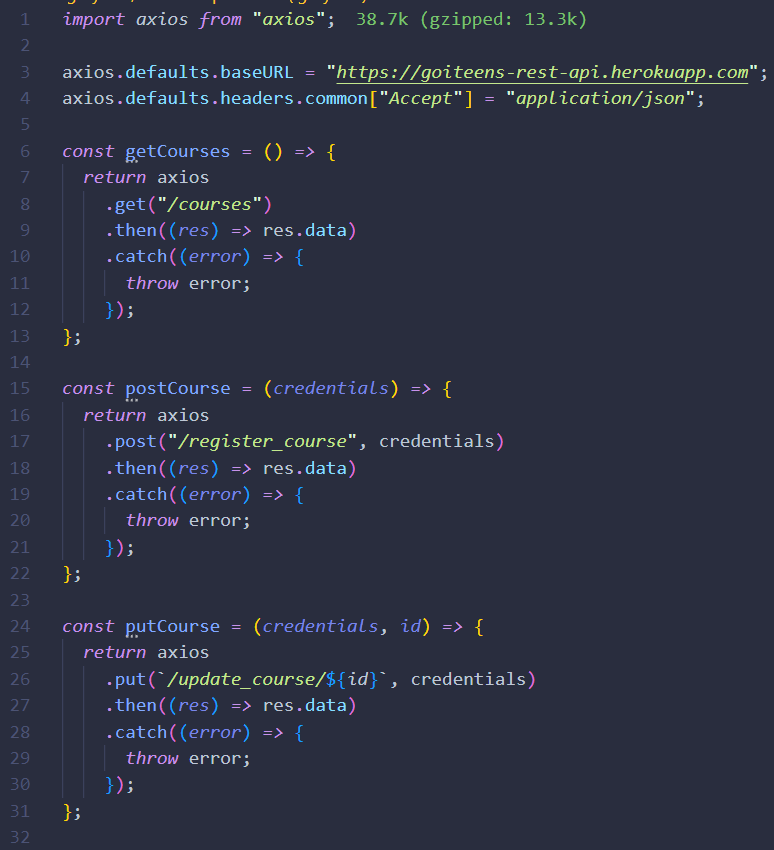
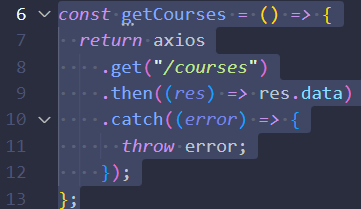
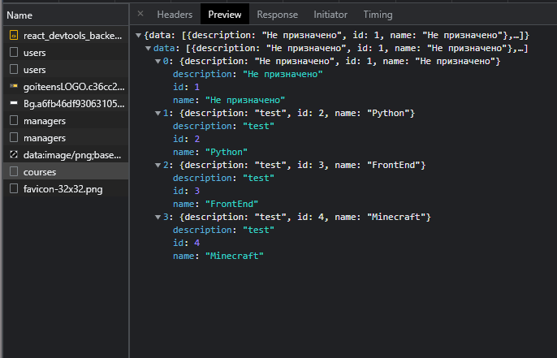

# Booking system
- [Get started](#get-started)
- [Description](#description)
- [Our Team](#our-team)
- [Tech Process](#tech-process)
  - [Front_End](#front_end-1)
    - [Project structure](#project-structure)
    - [Redux structure](#redux-structure)
    - [Api structure](#api-structure)
  - [Back_End](#back_end-1)

## Get started

#### `Dependencies:`
1. Lts version of Node
2. Npm version 8.3.0 and higher

#### `Commands`
1. Запуск проєкту `npm start`
2. Деплой проєкту `npm run deploy`

#### `Guide`
1. Склонуйте репозиторій 
```json
git clone https://github.com/DmytroKolisnyk2/booking-system
```
2. Встановіть залежності
```json
npm clean-install
```
3. Запустіть проєкт 
```json
npm start
```

## Description

Intern проект нашої команди з використанням `react 18.0.2, redux, scss, momentJS, react router 6` та інших бібліотек.   
На даний момент готові сторінки -
- `Caller` - людини що назначає зустрічі на конкретного менеджера в конкретний час,   
- `Manager` - що обирає коли в нього вільний час, коли робочий, а коли консультації, а також може запускати та змінювати інформацію констультацій
- `Confirmator` - що змінує статус зустрічі, яку назначає коллер, перенесена, відмінена, або ж підтверджена, а також коментар до зустрічі
- `Superadmin`- що створює адмінів та інших користувачів, курси і групи
- `admin` - що створює користувачів, курси і групи

В майбутньому плануємо додати `авторизацію`, `зміну мови` :)

## Our team

Наша команда складається з 8'ми людей, всі вони внесли свій вклад у проект, тим самим пришвидшивши його реліз, а ось і наша команда:

#### `Design`
- [Ярина Виноградова](https://www.figma.com/files/recent?fuid=966368081114943131) - Дизайнер, розробила дизайн проєкту;

#### `Front_End`
  Наші фронтендери 🥰🥰🥰
- [Дмитро Колісник](https://github.com/DmytroKolisnyk2) - TeamLead, керував розробкою проєкту, розробив сторінку `Confirmator`, а також слідкував за кодом;
- [Максим Попсуй](https://github.com/MaxPopsuy)  - Розробив мультифункіональні компоненти, модальні вікна і сторінку `Caller`, а також займався внесенням правок і багфіксом; 
- [Ігор Якіб'юк](https://github.com/Igoryakib)   - Розробив структуру Redux (Duuuucks 🦆) для проєкту, мультифункціональні компоненти, сторінку `Manager`, а також займався внесенням правок і багфіксом;
- [Анна-Домініка Козак](https://github.com/Anna-Dominika1) - Розробила сторінку `SuperAdministator` і `Administrator`;  
- [Євген Бочаров](https://github.com/Eugene-Bocharov)   - Брав участь у розробці сторінки `Manager`;

#### `Back_End`
Наші пайтоністи 🥰🥰🥰
- [Ярослав Висоцький](https://github.com/Yaroslav702) - Розробив структуру `Back_End`  
- [Олександр Зборовський](https://github.com/dormyyy)  - Створював роути `Back_End`


## Tech process

 ### Front_End

- #### `Project structure`
Структура нашого проєкту виглядає ось так:


На фото ви бачите кореневу папку `src` в якій знаходиться серце ❤ нашого проекту: `components`, `helpers`, `img`, `pages`, `redux`, App і глобальні стилі. На фото нижче ви побачите наповнення важливих папок:

  

  


- #### `Redux structure`
Redux🦆 у нас виглядає наступним чином:

У Vs Code структура папок📁:


У Chrome DevTools⚙: 


Структура Юзерів `Manager` і `Caller`:


Структура Юзерів `Caller` і `Confirmator`:


Структура тижня `week`:


Саме дерево 🌳 Redux:


Коли ознайомились зі структурою вище, можемо перейти до самого коду. Маленький екскурс: Ви могли замітити, що поля в менеджера, колера і кофірматора частково, а інколи повністю співпадають і це не похибка, все вірно. Так, як у всіх трьох функціонал схожий, а батьком для 2 останніх можна вважати `Manager`, тому тут розглянемо саме його.


- #### `Api structure`


На фото вище ви можете побачити структуру папки `helpers` що виконує роль Api проєкту, в ній є всі запити на бекенд що використовуються в нашому проєкті, всі вони мають однакову структуру, 

А зараз ми розберумося з найлегшою категорією запитів - `course`. 
На фото нижче ви можете детальніше побачити структуру наших запитів 🎯:



Ми використовуємо бібліотеку axios для полегшення роботи з сервером, також в кожному файлі в основному чотири типи запитів - `get`, `post`, `put`, `delete`, зараз ми розберемо на прикладі запит getCourses():



Ця функція робить get-запит на наш бекенд з роутом `courses`, і повертає усі дані що отримує з нього, тобто ми в будь якому місці коду можемо викликати цю функцію, і отримати данні курсів, і так з будь-яким запитом.

Ну а ось що цей запит повертає з бекенду 🔑:



 ### Back_End

Скоро буде :)


